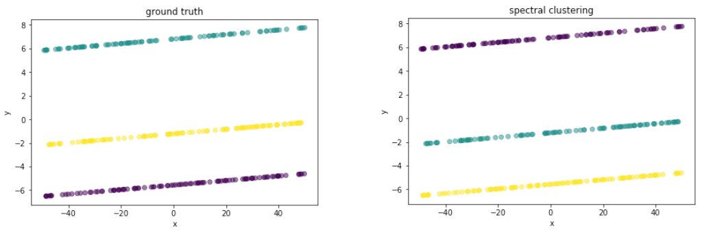
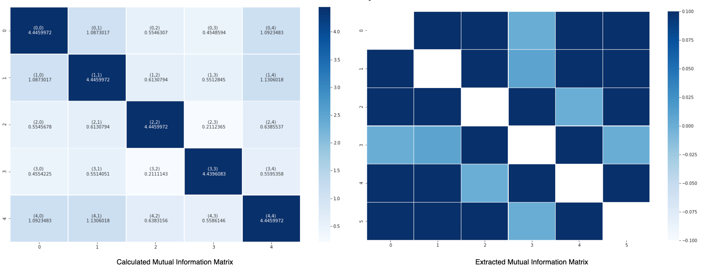
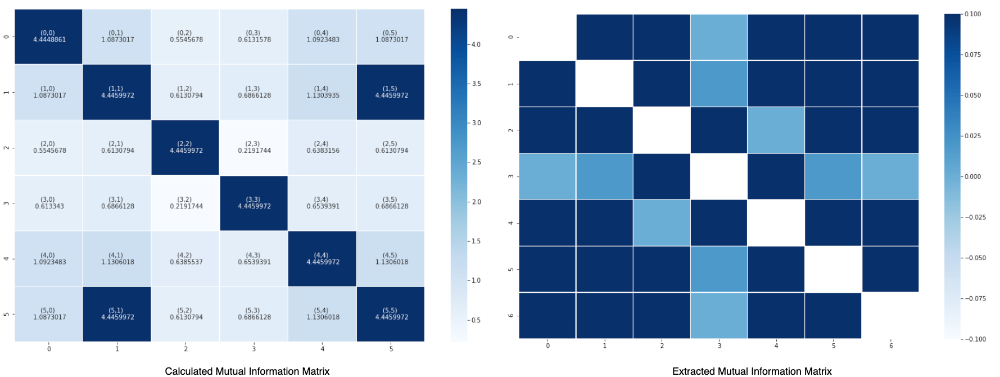
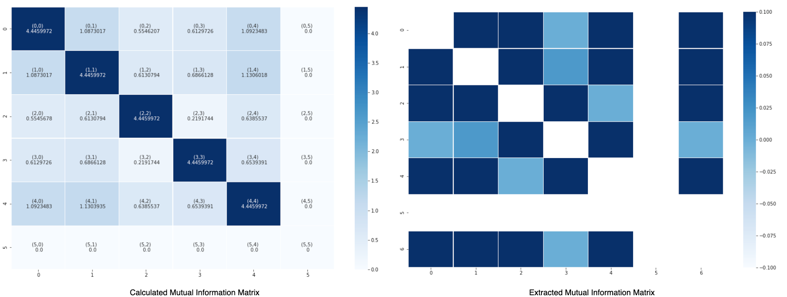
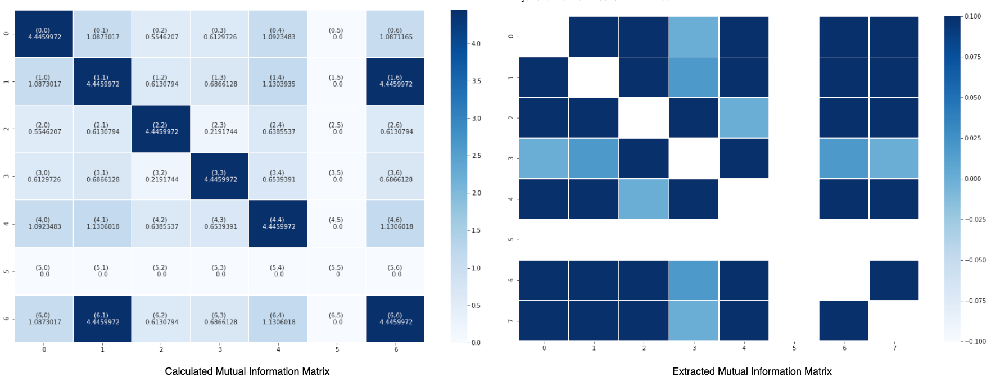
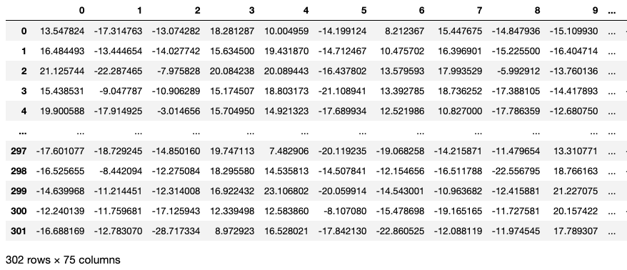
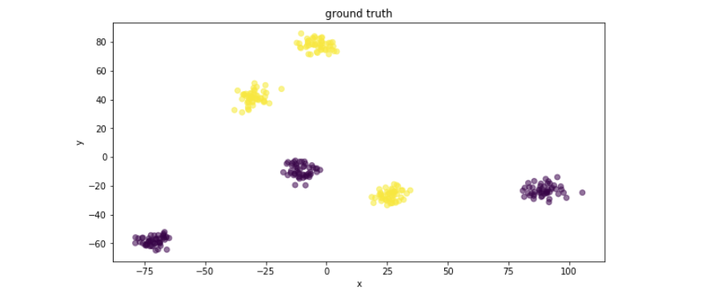

# Pipleline Step Validation

## 1. Overview

In order to ensure the correctness of each pipeline step, validation for each of the pipeline step is performed using the simulated datasets with defined "ground truth" to determine if the actual outputs align with the expected outputs. All of the validation code are stored in `validation.ipynb` files. All of the datasets used are stored under the `datasets`  folder. 

```bash
.
├── README.md
├── datasets
│   ├── X.p
│   ├── X_integrated.csv
│   ├── classification_simulated_data.csv
│   ├── clustering_simulated_data.csv
│   ├── combat_base_simulated_data.csv
│   ├── combat_outlier_simulated_data.csv
│   ├── mrmr_base_noise_simulated_data.csv
│   ├── mrmr_base_redundant_noise_simulated_data.csv
│   ├── mrmr_base_redundant_simulated_data.csv
│   ├── mrmr_base_simulated_data.csv
│   ├── mrmr_base_swap_simulated_data.csv
│   ├── subtype_labels.csv
│   ├── ttest_simulated_data.csv
│   ├── y.p
│   └── y_integrated.csv
├── img
│   ├── Xi.png
│   ├── clustering.png
│   ├── integrated_cluster.png
│   ├── noise.png
│   ├── noise_redundant.png
│   ├── redundant.png
│   └── swap.png
├── parallel.py
├── results
│   └── fold0
│       ├── outerfold0_good_results_features_2_50\ copy.csv
│       ├── outerfold0_good_results_features_2_50.csv
│       ├── outerfold0_good_results_features_2_50.pkl
│       ├── outerfold0_results_for_each_fold_features_2_50.csv
│       ├── outerfold0_results_for_each_fold_features_2_50.pkl
│       ├── outerfold0_results_for_each_param_setting_features_2_50.csv
│       └── outerfold0_results_for_each_param_setting_features_2_50.pkl
├── split
│   ├── outer_test_index.pickle
│   └── outer_train_index.pickle
├── split.py
└── validation.ipynb
```

Above is the file directory tree of the code validation section of the project. 

- **/datasets** folder: stores all of the simulated datasets for each pipeline step
- **parallel.py** file: execution code for inner loop pipeline grid search (using the X_integrated.csv and y_integrated.csv dataset)
- **/results** folder: stores all of the results for the inner loop execution results
- **/split** folder: stores the indexes of train test data splitting of the integrated simulated dataset (X_integrated.csv and y_integrated.csv)
- **split.py** file: generate data splitting for the integrated simulated dataset (X_integrated.csv and y_integrated.csv)
- **validation.ipynb** file: the main file for code validation of each pipeline step (including the data generation and actual validation)

---

## 2. Data Generation

The simulated datasets are generated in mainly two ways:

- `scikit-learn` APIs: The API is used to generate "complex" datasets for classification and clusterings. Two main functionalities used are:

  - [sklearn.datasets.make_classification](https://scikit-learn.org/stable/modules/generated/sklearn.datasets.make_classification.html) : Generate a random n-class classification problem

  - [sklearn.datasets.make_blobs](https://scikit-learn.org/stable/modules/generated/sklearn.datasets.make_blobs.html) : Generate isotropic Gaussian blobs for clustering

  Examples:

  ```python
  X,y = make_classification(n_samples=302, 
                            n_features=75, 
                            n_informative=50, 
                            n_redundant=0, 
                            n_classes=2, 
                            n_clusters_per_class=3, 
                            weights=None, 
                            class_sep=15.0, 
                            hypercube=True,
                            shuffle=False, 
                            random_state=None)
  ```

- Self-written functions to generate trivial datasets:

  - `generate_dummy_dataset(label_list, n_samples_label, inform_mean_list, inform_std_list, n_noise=None)` 

  Function implementation:

  ```python
  def generate_dummy_dataset(label_list, n_samples_label, inform_mean_list, inform_std_list, n_noise=None):
      # check if the input parameters are correct
      n_features = len(inform_std_list)
      n_samples = sum(n_samples_labels)
      for i in range(len(inform_mean_list)):
          assert len(inform_mean_list[i]) == n_features
      
      assert len(label_list) == len(n_samples_labels)
      
      X,y = [],[]
      for i,v in enumerate(n_samples_labels):
          class_data = []
          for j in range(n_features):
              col = np.random.normal(inform_mean_list[i][j], inform_std_list[j], v).reshape(-1,1)
              class_data.append(col)
          class_labels = [label_list[i] for k in range(v)]
          class_data = np.concatenate(class_data, axis=1).reshape(v,n_features)
          X.append(class_data)
          y.append(class_labels)
          
      X = np.concatenate(X,axis=0)
      y = np.asarray([item for sublist in y for item in sublist])
      
      if n_noise is not None:
          n_noise_col = n_noise[0]
          noise_range = n_noise[1]
          noise_data = np.random.uniform(low=noise_range[0], high=noise_range[1], size=(n_samples,n_noise_col))
          X = np.concatenate((X, noise_data), axis=1)
          
      return X, y
  ```

  Example:

  ```python
  label_list = [1,2]
  n_samples_labels = [5,5]
  inform_mean_list = [[10,10,10,10],[20,20,20,20]]
  inform_std_list = [0.0001, 0.0001, 0.0001, 0.0001]
  n_noise = [0, 0.000001, (0,100)]
  X_base, y_base = generate_dummy_dataset(label_list, n_samples_labels, inform_mean_list,inform_std_list)
  print(X_base, y_base)
  ```

  Output:

  ```
  [[10.00001462  9.9999496   9.99988075  9.99987458]
   [10.0000919   9.99992845  9.99997808 10.00002573]
   [ 9.99993092  9.99990442  9.9999916  10.00002373]
   [ 9.99996301  9.99997824  9.99994909 10.00009867]
   [ 9.99988776  9.99994875  9.99988978  9.99989287]
   [19.99998223 19.99984316 19.99982978 20.00022207]
   [20.0002423  19.99998785 19.9999297  20.00022668]
   [20.00023134 19.99995161 20.00003872 19.99994302]
   [20.00002406 20.00011922 19.99994888 19.99992723]
   [20.00001249 20.00008134 19.99993409 19.99997605]]
  ```

  All of the simulated datasets stored under `/datasests` are generated and used for the validation purposes and they are generated along with the execution of `validation.ipynb` file. Note that each time the `validation.ipynb` file is re-run, original datasets may be replaced by the newly generated datasets. Prevent running the ***save simulated datasets*** code blocks under each section to keep the old version of the simulated datasets. Seperate scripts to read the existing simulated datasets will be added in the future.

  ---

## 3. Pipeline Steps Validation

### 3.1 Feature Reduction Step (T-test)

The feature reduction step is applied only on FC-GM dataset to reduce the total number of features down to 10% of its original size. It aims to remove features that have low relevance in differentiating the classes. T-test statistics is employed for this purpose. 

The validation code for Feature Reduction Step can be found in `validation.ipynb` under ***Section 3***. The simulated datasets used to validate the step is generated using the `generate_dummy_dataset` function. 

The path to the generated simulated datasest is: `/datasets/ttest_simulated_data.csv`. The last column corresponds to the label.

The meta information of the simulated dataset is summarized as following:

- ***300*** samples
- ***7 features*** (4 informative features; 3 randomly generated noise features)
  - index for ***informative features***: [0, 1, 2, 3]
  - index for ***uninformative features***: [4, 5, 6]
- ***2*** classes
  - Mean values of informative features for class 1: [2, 9, 7, 2]
  - Mean values of informative features for class 2: [9, 1, 2, 6]
  - Standard deviation of generated informative features: [0.0001, 0.0001, 0.0001, 0.0001]

Dataset snapshot:

```
X_ttest_base: 
 [[ 1.99987861  9.00009529  6.999879   ... 68.47663344 67.38421027
  30.717765  ]
 [ 2.00018866  9.00008163  6.99994704 ... 72.42864757 35.20120916
  43.48937762]
 [ 1.999791    8.99993024  6.99988622 ... 76.11559446 44.29928999
   9.33903386]
 ...
 [ 8.99996795  1.00016002  1.99992334 ... 63.20839764 18.06747326
  53.77168036]
 [ 9.00009527  0.99996585  1.99987161 ... 57.17926085 32.65607412
  90.83715886]
 [ 9.00003086  1.0000186   2.00003513 ... 88.00478944  5.50215028
  31.2981323 ]]
y_ttest_base: 
 [0 0 0 0 0 0 0 0 0 0 0 0 0 0 0 0 0 0 0 0 0 0 0 0 0 0 0 0 0 0 0 0 0 0 0 0 0
 0 0 0 0 0 0 0 0 0 0 0 0 0 0 0 0 0 0 0 0 0 0 0 0 0 0 0 0 0 0 0 0 0 0 0 0 0
 0 0 0 0 0 0 0 0 0 0 0 0 0 0 0 0 0 0 0 0 0 0 0 0 0 0 0 0 0 0 0 0 0 0 0 0 0
 0 0 0 0 0 0 0 0 0 0 0 0 0 0 0 0 0 0 0 0 0 0 0 0 0 0 0 0 0 0 0 0 0 0 0 0 0
 0 0 1 1 1 1 1 1 1 1 1 1 1 1 1 1 1 1 1 1 1 1 1 1 1 1 1 1 1 1 1 1 1 1 1 1 1
 1 1 1 1 1 1 1 1 1 1 1 1 1 1 1 1 1 1 1 1 1 1 1 1 1 1 1 1 1 1 1 1 1 1 1 1 1
 1 1 1 1 1 1 1 1 1 1 1 1 1 1 1 1 1 1 1 1 1 1 1 1 1 1 1 1 1 1 1 1 1 1 1 1 1
 1 1 1 1 1 1 1 1 1 1 1 1 1 1 1 1 1 1 1 1 1 1 1 1 1 1 1 1 1 1 1 1 1 1 1 1 1
 1 1 1 1]
```

Validation results:

```
total_nfeatures:  7
filtered_nfeatures 4
columns_ttest:  [0, 1, 2, 3]
```

The t-test filtering aims to filter out 3 features out of the 7 features. The result shows that the selected features are [0, 1, 2, 3] which corresponds to the informative features. The uninformative or "noise" features are filtered out.

---

### 3.2 Subtype Clustering Step

The subtype clustering step is used to find subtypes of the progressors and stables in anunsupervised  manner. The main alogorithm deployed to perform the clustering is ***spectral clustering***.

The validation code for Subtype Clustering Step can be found in `validation.ipynb` under ***Section 4***. The simulated datasets used to validate the step is generated using the `generate_dummy_dataset` function. 

The path to the generated simulated datasest is: `/datasets/clustering_simulated_data.csv`. The last column corresponds to the label. 

The meta information of the simulated dataset is summarized as following:

- ***300*** samples
- ***5 features*** (4 informative features; 1 randomly generated noise features)
  - index for ***informative features***: [0, 1, 2, 3]
  - index for ***uninformative features***: [4]
- ***3*** classes
  - Mean values of informative features for class 1: [2, 9, 7, 2]
  - Mean values of informative features for class 2: [9, 1, 2, 6]
  - Mean values of informative features for class 2: [5, 9, 1, 4]
  - Standard deviation of generated informative features: [0.0001, 0.0001, 0.0001, 0.0001]

Dataset snapshot:

```
X_clustering_base: 
 [[ 1.99993607  8.99988309  7.0000718   1.99997781 10.83866922]
 [ 1.99982525  8.9999829   6.99986095  2.0000373   8.53631131]
 [ 1.99998189  9.00007723  6.99991209  1.99985021 70.81452422]
 ...
 [ 5.00000503  9.00001764  0.99989893  3.99990279 81.49890237]
 [ 4.99999383  8.99998789  1.00008012  4.00020877 96.99674997]
 [ 4.99986991  8.99986544  0.99989916  3.9999219  98.26687812]]
y_clustering_base: 
 [0 0 0 0 0 0 0 0 0 0 0 0 0 0 0 0 0 0 0 0 0 0 0 0 0 0 0 0 0 0 0 0 0 0 0 0 0
 0 0 0 0 0 0 0 0 0 0 0 0 0 0 0 0 0 0 0 0 0 0 0 0 0 0 0 0 0 0 0 0 0 0 0 0 0
 0 0 0 0 0 0 0 0 0 0 0 0 0 0 0 0 0 0 0 0 0 0 0 0 0 0 1 1 1 1 1 1 1 1 1 1 1
 1 1 1 1 1 1 1 1 1 1 1 1 1 1 1 1 1 1 1 1 1 1 1 1 1 1 1 1 1 1 1 1 1 1 1 1 1
 1 1 1 1 1 1 1 1 1 1 1 1 1 1 1 1 1 1 1 1 1 1 1 1 1 1 1 1 1 1 1 1 1 1 1 1 1
 1 1 1 1 1 1 1 1 1 1 1 1 1 1 1 2 2 2 2 2 2 2 2 2 2 2 2 2 2 2 2 2 2 2 2 2 2
 2 2 2 2 2 2 2 2 2 2 2 2 2 2 2 2 2 2 2 2 2 2 2 2 2 2 2 2 2 2 2 2 2 2 2 2 2
 2 2 2 2 2 2 2 2 2 2 2 2 2 2 2 2 2 2 2 2 2 2 2 2 2 2 2 2 2 2 2 2 2 2 2 2 2
 2 2 2 2]
```

Validation result:



The clustering visualization is done using ***Principal Component Analysis*** technique and the above result shows that the clustering results returned by the pipeline align with the ground truth clusters of the dataset. 

---

### 3.3 Feature Selection Step (MRMR)

The  mRMR  step  is  the  feature  selection  step  after  the  subtypes  are  identified. In  ourimplementation, the R-mRMR package is deployed with a Python wrapper as API. The mRMRalgorithm selects features based on the high relevance with respect to the target and at the sametime, filters out redundant features. 

The validation code for feature selection step can be found in `validation.ipynb` under ***Section 5***. The simulated datasets used to validate the step is generated using the `generate_dummy_dataset` function. 

Five datasets are generated:

1. base dataset
2. base dataset + feature swap
3. base dataset + uninformative features
4. base dataset + redundant features
5. Base dataset + uninformative features + redundant features

#### Base Dataset

The path to base dataset + feature swap is : `/datasets/mrmr_base_simulated_data.csv`. The last column corresponds to the label. 

The meta information of the simulated ***base dataset*** is summarized as following:

- ***300*** samples
- ***5 features*** (5 informative features; 1 randomly generated noise features)
  - index for ***informative features***: [0, 1, 2, 3, 4]
- ***3*** classes
  - Mean values of informative features for class 1: [1, 2, 3, 4, 5]
  - Mean values of informative features for class 2: [5, 4, 3, 2, 1]
  - Mean values of informative features for class 2: [9, 5, 2, 4, 3]
  - Standard deviation of generated informative features: [0.0001, 0.0001, 0.0001, 0.0001, 0.0001]

Base dataset snapshot:

```
X_mrmr_base: 
 [[1.00009531 2.00000139 3.00021737 3.99987166 4.99997622]
 [0.99997544 1.99997624 2.99991967 4.00009469 4.99990906]
 [0.99987749 2.0000039  3.00021725 3.99987151 5.00011318]
 ...
 [8.99999613 5.00006471 1.99997715 4.00009269 2.99996137]
 [8.99999939 4.99996357 1.99985969 4.00009599 3.0000611 ]
 [9.00014158 5.00006495 2.00001502 3.99993462 3.00000567]]
y_mrmr_base: 
 [0 0 0 0 0 0 0 0 0 0 0 0 0 0 0 0 0 0 0 0 0 0 0 0 0 0 0 0 0 0 0 0 0 0 0 0 0
 0 0 0 0 0 0 0 0 0 0 0 0 0 0 0 0 0 0 0 0 0 0 0 0 0 0 0 0 0 0 0 0 0 0 0 0 0
 0 0 0 0 0 0 0 0 0 0 0 0 0 0 0 0 0 0 0 0 0 0 0 0 0 0 1 1 1 1 1 1 1 1 1 1 1
 1 1 1 1 1 1 1 1 1 1 1 1 1 1 1 1 1 1 1 1 1 1 1 1 1 1 1 1 1 1 1 1 1 1 1 1 1
 1 1 1 1 1 1 1 1 1 1 1 1 1 1 1 1 1 1 1 1 1 1 1 1 1 1 1 1 1 1 1 1 1 1 1 1 1
 1 1 1 1 1 1 1 1 1 1 1 1 1 1 1 2 2 2 2 2 2 2 2 2 2 2 2 2 2 2 2 2 2 2 2 2 2
 2 2 2 2 2 2 2 2 2 2 2 2 2 2 2 2 2 2 2 2 2 2 2 2 2 2 2 2 2 2 2 2 2 2 2 2 2
 2 2 2 2 2 2 2 2 2 2 2 2 2 2 2 2 2 2 2 2 2 2 2 2 2 2 2 2 2 2 2 2 2 2 2 2 2
 2 2 2 2]
```

---

#### Base Dataset + Feature Swap

The path to base dataset + feature swap is : `/datasets/mrmr_base_swap_simulated_data.csv`. The last column corresponds to the label. 

Feature swapping is performed on ***column 3***. For data points from each class, ***15*** rows are swapped to intorduce the noise for the dataset.

Output:

```
Selected Features by MRMR:  [0, 1, 2, 4]
```



4 features are to be selected out of 5 features. The output of the feature selection step indicates that the ***feature 3*** is not selected which corresponds to the swapped column. 

---

#### Base Dataset + Redundant Feature

The path to base dataset + redundant feature is : `/datasets/mrmr_base_redundant_simulated_data.csv`. The last column corresponds to the label. 

Redundant feature column is computed based on the ***existing informative feature column 1***. In this case, it is computed as such:

```python
def generate_redundant(X,index,slope,intercept):
    X_temp = X.copy()
    redundant_col = X_temp[:,index] * slope + intercept
    return redundant_col
  
reduandant_col_1 = generate_redundant(X_mrmr_base,1, 2.5, 0.4) 
```

The linear combination uses a slope of 2.5 and an intercept of 0.4.

The computed redundant feature column is appended to the last column of the base dataset (column index 5).

Output:

```
Selected Features by MRMR:  [0, 1, 2, 4, 3]
```



5 features are to be selected out of 6 features. The output of the feature selection step indicates that the ***feature 5*** is not selected which corresponds to the redundant feature column. 

---

#### Base Dataset + Noise Feature

The path to base dataset + noise feature is : `/datasets/mrmr_base_noise_simulated_data.csv`. The last column corresponds to the label. 

Noise (uninformative) feature column is simple a column with 1s and hence, it does not contribute to differentiate the classes.

```python
noise_col = [1 for i in range(300)]
```

The generated noise feature column is appended to the last column of the base dataset (column index 5).

Output:

```
Selected Features by MRMR:  [0, 1, 2, 4, 3]
```



5 features are to be selected out of 6 features. The output of the feature selection step indicates that the ***feature 5*** is not selected which corresponds to the noise feature column. 

---

#### Base Dataset + Noise Feature + Redundant Feature

The path to base dataset + noise + redundant features is : `/datasets/mrmr_base_redundant_noise_simulated_data.csv`. The last column corresponds to the label. 

This dataset is a combination of the base dataset with the previously used redundant feature column as well as the noise feature column.

- there are 7 features
- ***feature 5*** is the ***noise*** feature column
- ***feature 6*** is the ***redundant*** feature column

The generated noise feature column is appended to the last column of the base dataset (column index 5).

Output:

```
Selected Features by MRMR:  [0, 1, 2, 4, 3]
```



5 features are to be selected out of 7 features. The output of the feature selection step indicates that the ***feature 5*** and ***feature 6*** are not selected which corresponds to the noise and redundant feature column.

---

### 3.4 Classification Step

Classification step validation is straight forward. `sklearn.datasets.make_classification` API is designed for generating random datasets for classification problem. 

The validation code for classification step can be found in `validation.ipynb` under ***Section 6***. The simulated datasets used to validate the step is generated using the `make_classification` function. 

The dataset is generated as following:

```python
n_total = 10
n_informative = 5
n_redundant = 5

X_before_mrmr, y_before_mrmr = make_classification(shuffle=False, 
                                                   n_samples=1000,
                                                   n_features=n_total,
                                                   n_redundant=n_redundant,
                                                   n_classes=4,
                                                   n_informative=n_informative,
                                                   n_clusters_per_class=2,
                                                   class_sep=5
                                                  )
```

The path to classification dataset is : `/datasets/classification_simulated_data.csv`. The last column corresponds to the label. 

Summarization of the classification simulated dataset:

- ***1000*** samples
- ***15 features*** (5 informative features; 5 redundant features; 5 uninformative features)
- ***4*** classes

The dataset uses 0.2 train-test-splitting for validation purposes. 

Ouput:

```
SVM Classifier Accuracy Score:  0.995
RF Classifier Accuracy Score:  0.995
LR Classifier Accuracy Score:  0.995
```

The validation results shows that the three classifiers perform well for the simulated dataset with same accuracy scores.

---

### 3.5 Combat Step

The purpose of the Combat Step is to normalize the MRI scans from the effect raised by different sites of acquisition. In order to validate this step, we manually generated a dataset consisting of the data with different scales. The varied scale of each data point represents the site difference from place to place. And we expect to see that the scale of all data points to be normalized after the combat step. We also created outliers to verify the expected performance of NeuroCombat. 

The validation code for classification step can be found in `validation.ipynb` under ***Section 7***. The simulated datasets used to validate the step is generated using the `generate_dummy_dataset` function. 

#### Base Dataset

The path to classification dataset is : `/datasets/combat_base_simulated_data.csv`. The ***site, age and sex*** columns are appended at the end of the dataset.

Base dataset snapshopt:

```
[[10.00001462  9.9999496   9.99988075  9.99987458]
 [10.0000919   9.99992845  9.99997808 10.00002573]
 [ 9.99993092  9.99990442  9.9999916  10.00002373]
 [ 9.99996301  9.99997824  9.99994909 10.00009867]
 [ 9.99988776  9.99994875  9.99988978  9.99989287]
 [19.99998223 19.99984316 19.99982978 20.00022207]
 [20.0002423  19.99998785 19.9999297  20.00022668]
 [20.00023134 19.99995161 20.00003872 19.99994302]
 [20.00002406 20.00011922 19.99994888 19.99992723]
 [20.00001249 20.00008134 19.99993409 19.99997605]]
 
 labels:
 [1 1 1 1 1 2 2 2 2 2]
```

Site, age and sex columns:

```
[[ 1 91  1]
 [ 1 92  1]
 [ 1 93  1]
 [ 1 94  1]
 [ 1 95  1]
 [ 2 91  1]
 [ 2 92  1]
 [ 2 93  1]
 [ 2 94  1]
 [ 2 95  1]]
```

Output after NeuroCombat harmonization:

```
[[15.00007211 14.99998337 14.99987719 14.99990692]
 [15.00016728 14.99995751 14.99998123 15.00006395]
 [14.99998333 14.99992852 14.99999496 15.00006297]
 [15.00002555 15.00000593 14.99994831 15.00014137]
 [14.99994203 14.99997099 14.99988355 14.99993012]
 [14.99995815 14.99983345 14.99984748 15.00016604]
 [15.00015695 14.99995565 14.99992965 15.00016327]
 [15.00014256 14.99993329 15.00001911 14.99992718]
 [14.99997376 15.00007381 14.99994934 14.9999079 ]
 [14.99995889 15.00005012 14.99993966 14.99994092]]
```

---

#### Base Dataset + Outlier Data Point

Small modification is added to the base dataset which creates an outlier data point. 

The path to classification dataset is : `/datasets/combat_outlier_simulated_data.csv`. The ***site, age and sex*** columns are appended at the end of the dataset.

Base dataset with outlier snapshopt:

```
Base Dataset + Outlier
 [[ 10.00001462 100.           9.99988075   9.99987458]
 [ 10.0000919    9.99992845   9.99997808  10.00002573]
 [  9.99993092   9.99990442   9.9999916   10.00002373]
 [  9.99996301   9.99997824   9.99994909  10.00009867]
 [  9.99988776   9.99994875   9.99988978   9.99989287]
 [ 19.99998223  19.99984316  19.99982978  20.00022207]
 [ 20.0002423   19.99998785  19.9999297   20.00022668]
 [ 20.00023134  19.99995161  20.00003872  19.99994302]
 [ 20.00002406  20.00011922  19.99994888  19.99992723]
 [ 20.00001249  20.00008134  19.99993409  19.99997605]]
```

Site, age and sex columns:

```
[[ 1 91  1]
 [ 1 92  1]
 [ 1 93  1]
 [ 1 94  1]
 [ 1 95  1]
 [ 2 91  1]
 [ 2 92  1]
 [ 2 93  1]
 [ 2 94  1]
 [ 2 95  1]]
```

Output after NeuroCombat harmonization:

```
Harmonized: 
 [[15.00007348 87.99274489 14.99988039 14.99992344]
 [15.0001603  10.00385041 14.99997662 15.00006315]
 [14.99998707  8.66926047 14.99999011 15.00005917]
 [15.00002456  7.33475386 14.99994828 15.00012738]
 [14.9999449   6.00015926 14.99988985 14.99993218]
 [14.99995064 23.60030621 14.9998404  15.00017664]
 [15.0001621  23.80013495 14.99993001 15.0001782 ]
 [15.00014843 23.99977874 15.00002767 14.99991422]
 [14.99997167 24.1996309  14.99994949 14.99989699]
 [14.99995748 24.399273   14.99993767 14.99993927]]
```

The validation results shows that the dataset is normalized to the same scale based on the site of differences and outlier data points are taken into the consideration as well. ***However, further investigation might be needed to look into how the discrete and continuous covariants affects the scaling of the normalization***.

---

## 4. Integrated Validation of the Inner Loop Execution

After the validation of each of the pipeline steps individually using different datasets, an integrated simulated dataset is generated with the help of  `sklearn.datasets.make_classification` API which incorporate more complexity. The ***Combat Step*** is excluded for the integrated validation due to the high complexity involved in generating complex dataset with explicit use of site, age and sex features. The rest of the pipelines steps are all involved. 

### 4.1 Integrated Dataset

The path to classification dataset is at:

- X integrated : `/datasets/X_integrated.csv`
- labels (y integrated) : `/datasets/y_integrated.csv`
- subtype labels : `/datasets/subtype_labels.csv`

The dataset is generated using the `sklearn.datasets.make_classification` API: 

```python
X,y = make_classification(n_samples=302, 
                          n_features=75, 
                          n_informative=50, 
                          n_redundant=0, 
                          n_classes=2, 
                          n_clusters_per_class=3, 
                          weights=None, 
                          class_sep=15.0, 
                          hypercube=True,
                          shuffle=False, 
                          random_state=None)
```

---

Summarization of the dataset:

- ***302 samples***
- ***100 features***
  - 50 informative features (index from 0 to 49)
  - 25 redundant features (index from 49 to 74)
  - 25 uninformative features (index from 75 to 99)

- 2 classes
  - Progressors: 3 sub clusters
  - Stables: 3 sub clusters

X_integrated snapshot:



---

Below is the visualization of the data clusters. ***Purple*** clusters corresponds to ***stables*** and ***Yellow*** clusters corresponds to ***progressors***. 




---

The `y_integrated.csv` file contains the actual labels of the data points (stable/progressor). 

```
y_integrated: 
 [1 1 1 1 1 1 1 1 1 1 1 1 1 1 1 1 1 1 1 1 1 1 1 1 1 1 1 1 1 1 1 1 1 1 1 1 1
 1 1 1 1 1 1 1 1 1 1 1 1 1 1 1 1 1 1 1 1 1 1 1 1 1 1 1 1 1 1 1 1 1 1 1 1 1
 1 1 1 1 1 1 1 1 1 1 1 1 1 1 1 1 1 1 1 1 1 1 1 1 1 1 1 1 1 1 1 1 1 1 1 1 1
 1 1 1 1 1 1 1 1 1 1 1 1 1 1 1 1 1 1 1 1 1 1 1 1 1 1 1 1 1 1 1 1 1 1 1 1 1
 1 1 1 2 2 2 2 2 2 2 2 2 2 2 2 2 2 2 2 2 2 2 2 2 2 2 2 2 2 2 2 2 2 2 2 2 2
 2 2 2 2 2 2 2 2 2 2 2 2 2 2 2 2 2 2 2 2 2 2 2 2 2 2 2 2 2 2 2 2 2 2 2 2 2
 2 2 2 2 2 2 2 2 2 2 2 2 2 2 2 2 2 2 2 2 2 2 2 2 2 2 2 2 2 2 2 2 2 2 2 2 2
 2 2 2 2 2 2 2 2 2 2 2 2 2 2 2 2 2 2 2 2 2 2 2 2 2 2 2 2 2 2 2 2 2 2 2 2 2
 2 2 2 2 2 2]
```

The `subtype_labels.csv` file contains the ground truth of the sub cluster labels of the data points:

```
subtype labels: 
 [0 0 0 0 0 0 0 0 0 0 0 0 0 0 0 0 0 0 0 0 0 0 0 0 0 0 0 0 0 0 0 0 0 0 0 0 0
 0 0 0 0 0 0 0 0 0 0 0 0 0 0 2 2 2 2 2 2 2 2 2 2 2 2 2 2 2 2 2 2 2 2 2 2 2
 2 2 2 2 2 2 2 2 2 2 2 2 2 2 2 2 2 2 2 2 2 2 2 2 2 2 2 1 1 1 1 1 1 1 1 1 1
 1 1 1 1 1 1 1 1 1 1 1 1 1 1 1 1 1 1 1 1 1 1 1 1 1 1 1 1 1 1 1 1 1 1 1 1 1
 1 1 1 3 3 3 3 3 3 3 3 3 3 3 3 3 3 3 3 3 3 3 3 3 3 3 3 3 3 3 3 3 3 3 3 3 3
 3 3 3 3 3 3 3 3 3 3 3 3 3 3 3 3 3 5 5 5 5 5 5 5 5 5 5 5 5 5 5 5 5 5 5 5 5
 5 5 5 5 5 5 5 5 5 5 5 5 5 5 5 5 5 5 5 5 5 5 5 5 5 5 5 5 5 5 4 4 4 4 4 4 4
 4 4 4 4 4 4 4 4 4 4 4 4 4 4 4 4 4 4 4 4 4 4 4 4 4 4 4 4 4 4 4 4 4 4 4 4 4
 4 4 4 4 4 4]
```

---

### 4.2 Data Splitting

Similar to the data stratified splitting technique used for the actual dataset, `split.py` file is modified to perform the outer fold data splitting. For the simulated dataset, the stratification is based on the ground truth subtype labels to ensure that there are equal proportions of data points from each sub cluster for each training and testing folds. For the validation, ***5 outer folds*** are created. 

To execute the `split.py` file, run the following:

```bash
python split.py 5 12
```

The following files will be generated:

```
.
├── outer_test_index.pickle
└── outer_train_index.pickle
```

The training and testing indexs are stored in `/split/outer_train_index.pickle` and `/split/outer_test_index.pickle` files. The training indexes for each fold is as following:

```
Training data indexes for outer fold 0
[  0   1   2   3   4   5   7   8   9  12  14  15  17  18  19  22  23  24
  25  26  28  29  30  31  32  33  34  35  36  37  38  39  40  41  43  44
  45  46  48  49  51  52  53  54  55  56  57  58  59  60  61  63  65  66
  68  69  70  72  73  74  76  77  78  79  80  82  83  84  85  86  88  89
  90  91  92  93  94  95  99 100 102 103 105 106 107 108 109 110 111 113
 115 116 118 119 120 121 122 123 124 127 128 130 131 132 134 136 137 138
 139 140 141 142 143 144 145 146 147 148 149 150 151 152 153 154 155 156
 157 158 159 160 161 162 164 165 166 167 168 169 172 173 174 175 177 178
 179 180 183 186 187 188 189 191 192 193 194 195 196 197 198 199 200 202
 203 204 205 207 208 209 211 212 213 215 216 217 218 219 220 221 222 223
 225 226 227 228 229 230 231 232 233 234 235 240 241 243 244 245 246 247
 248 250 251 252 253 254 255 256 257 259 260 262 263 264 265 266 267 269
 271 272 273 274 276 277 279 280 281 282 283 285 286 287 288 289 290 291
 293 294 295 297 298 299 301]
Training data indexes for outer fold 1
[  0   1   2   3   4   6   7   8   9  10  11  12  13  14  15  16  17  18
  20  21  23  24  25  26  27  29  33  34  35  37  39  40  41  42  43  44
  45  46  47  49  50  51  53  54  55  56  57  58  60  62  63  64  65  66
  67  68  69  71  72  73  75  76  77  79  80  81  82  85  86  87  88  89
  92  93  94  95  96  97  98  99 100 101 102 104 105 106 107 108 109 111
 112 114 116 117 118 119 120 124 125 126 127 128 129 130 131 132 133 134
 135 136 137 138 139 141 142 144 145 146 148 149 150 151 152 153 155 156
 159 160 161 163 164 166 167 168 169 170 171 172 174 175 176 177 180 181
 182 183 184 185 186 187 188 189 190 191 193 196 197 198 199 200 201 202
 203 204 205 206 207 208 209 210 211 212 213 214 215 216 217 218 219 221
 223 224 225 226 227 228 231 233 234 236 237 238 239 241 242 243 245 248
 249 250 251 252 253 254 255 256 257 258 259 260 261 263 264 266 267 268
 270 271 272 273 274 275 277 278 279 280 281 282 283 284 285 287 290 291
 292 293 295 296 299 300 301]
Training data indexes for outer fold 2
[  1   2   4   5   6   7   9  10  11  12  13  14  15  16  17  18  19  20
  21  22  23  26  27  28  30  31  32  33  34  36  37  38  39  40  41  42
  43  47  48  49  50  51  52  56  57  59  60  61  62  63  64  65  66  67
  68  70  71  72  73  74  75  76  77  78  80  81  83  84  87  88  89  90
  91  92  93  94  95  96  97  98  99 101 103 104 105 108 109 110 111 112
 113 114 115 116 117 118 120 121 122 123 125 126 127 129 132 133 134 135
 136 137 138 139 140 142 143 144 145 146 147 148 149 151 153 154 155 156
 157 158 159 160 161 162 163 165 166 167 168 169 170 171 173 174 175 176
 177 178 179 180 181 182 184 185 187 188 190 191 192 194 195 196 199 201
 203 204 206 209 210 212 214 215 216 217 218 219 220 221 222 223 224 227
 228 229 230 231 232 233 234 235 236 237 238 239 240 242 243 244 246 247
 248 249 250 251 253 254 255 258 259 260 261 262 265 266 267 268 269 270
 271 274 275 276 277 278 279 280 281 282 284 285 286 287 288 289 290 291
 292 294 296 297 298 299 300 301]
Training data indexes for outer fold 3
[  0   2   3   5   6   8   9  10  11  13  14  16  19  20  21  22  23  24
  25  26  27  28  29  30  31  32  33  35  36  38  39  40  41  42  43  44
  45  46  47  48  50  52  53  54  55  58  59  60  61  62  63  64  66  67
  69  70  71  74  75  78  79  80  81  82  83  84  85  86  87  88  89  90
  91  92  94  95  96  97  98  99 100 101 102 103 104 105 106 107 108 110
 111 112 113 114 115 117 119 121 122 123 124 125 126 128 129 130 131 133
 135 136 138 140 141 142 143 144 145 147 148 149 150 152 154 156 157 158
 159 162 163 164 165 166 168 169 170 171 172 173 175 176 178 179 181 182
 183 184 185 186 187 188 189 190 192 193 194 195 196 197 198 199 200 201
 202 204 205 206 207 208 209 210 211 213 214 218 219 220 221 222 223 224
 225 226 229 230 232 233 235 236 237 238 239 240 241 242 244 245 246 247
 248 249 250 251 252 253 256 257 258 261 262 263 264 265 266 267 268 269
 270 271 272 273 274 275 276 278 281 283 284 285 286 287 288 289 292 293
 294 295 296 297 298 299 300 301]
Training data indexes for outer fold 4
[  0   1   3   4   5   6   7   8  10  11  12  13  15  16  17  18  19  20
  21  22  24  25  27  28  29  30  31  32  34  35  36  37  38  42  44  45
  46  47  48  49  50  51  52  53  54  55  56  57  58  59  61  62  64  65
  67  68  69  70  71  72  73  74  75  76  77  78  79  81  82  83  84  85
  86  87  90  91  93  96  97  98 100 101 102 103 104 106 107 109 110 112
 113 114 115 116 117 118 119 120 121 122 123 124 125 126 127 128 129 130
 131 132 133 134 135 137 139 140 141 143 146 147 150 151 152 153 154 155
 157 158 160 161 162 163 164 165 167 170 171 172 173 174 176 177 178 179
 180 181 182 183 184 185 186 189 190 191 192 193 194 195 197 198 200 201
 202 203 205 206 207 208 210 211 212 213 214 215 216 217 220 222 224 225
 226 227 228 229 230 231 232 234 235 236 237 238 239 240 241 242 243 244
 245 246 247 249 252 254 255 256 257 258 259 260 261 262 263 264 265 268
 269 270 272 273 275 276 277 278 279 280 282 283 284 286 288 289 290 291
 292 293 294 295 296 297 298 300]
```

Testing data indexes for each outer folds are as follow:

```
Test data indexes for outer fold 0
[  6  10  11  13  16  20  21  27  42  47  50  62  64  67  71  75  81  87
  96  97  98 101 104 112 114 117 125 126 129 133 135 163 170 171 176 181
 182 184 185 190 201 206 210 214 224 236 237 238 239 242 249 258 261 268
 270 275 278 284 292 296 300]
Test data indexes for outer fold 1
[  5  19  22  28  30  31  32  36  38  48  52  59  61  70  74  78  83  84
  90  91 103 110 113 115 121 122 123 140 143 147 154 157 158 162 165 173
 178 179 192 194 195 220 222 229 230 232 235 240 244 246 247 262 265 269
 276 286 288 289 294 297 298]
Test data indexes for outer fold 2
[  0   3   8  24  25  29  35  44  45  46  53  54  55  58  69  79  82  85
  86 100 102 106 107 119 124 128 130 131 141 150 152 164 172 183 186 189
 193 197 198 200 202 205 207 208 211 213 225 226 241 245 252 256 257 263
 264 272 273 283 293 295]
Test data indexes for outer fold 3
[  1   4   7  12  15  17  18  34  37  49  51  56  57  65  68  72  73  76
  77  93 109 116 118 120 127 132 134 137 139 146 151 153 155 160 161 167
 174 177 180 191 203 212 215 216 217 227 228 231 234 243 254 255 259 260
 277 279 280 282 290 291]
Test data indexes for outer fold 4
[  2   9  14  23  26  33  39  40  41  43  60  63  66  80  88  89  92  94
  95  99 105 108 111 136 138 142 144 145 148 149 156 159 166 168 169 175
 187 188 196 199 204 209 218 219 221 223 233 248 250 251 253 266 267 271
 274 281 285 287 299 301]
```
---

### 4.3 Execution

The main file used to execute the inner loop is `parallel.py`. It is almost the same as the actual inner loop execution file, except that the Combat Step is excluded and no classification progressor weightings are added as the hyper parameters. Besides, for the feature reduction step (t-test), instead of keeping 10% of the features, 75% features are kept during the step as only 25% of the features are uninformative in the simulated dataset. Furthermore, the grid search is performed as well. The hyperparameters to be searched for are:

- num_features : 2 to 50
- num_progressor_subtypes : 1 to 3
- num_stable_subtypes : 1 to 3
- classifiers: [SVM, LR, RF]

Originally, the number of subtypes to be searched for is from 1 to 4 for both progressor and stable. In this case, it is defined from 0 to 3 as the ground truth value for subtypes is 3. 

To execute the file, run the following command:

```bash
python parallel.py c 0 2 50
```

- The first argument "c" means that the dataset is treated as functional connectivity dataset which activates the feature reduction step. 
- The second argument "0" indicates which outer fold data to be performed on. In this case, outer fold 0. 
- The third argument and fourth argument is the range for the number of features to be searched from. In this case, the gridsearch will search from 2 features to 50 features. 

After running the script, the following result files will be generated:

```
results
└── fold0
    ├── outerfold0_good_results_features_2_50.csv
    ├── outerfold0_good_results_features_2_50.pkl
    ├── outerfold0_results_for_each_fold_features_2_50.csv
    ├── outerfold0_results_for_each_fold_features_2_50.pkl
    ├── outerfold0_results_for_each_param_setting_features_2_50.csv
    └── outerfold0_results_for_each_param_setting_features_2_50.pkl
```

Note that the files with the same file name and different file extension are basically the same data. Files end with `.pkl` are used to store the actual data object for the ease of loading purposes.

---

### 4.4 Validation Results

Snapshot of `outerfold0_good_results_features_2_50.csv`:

|          | **num_P** | **num_S** | **num_Features** | **classifier** | **weighting** | **precision_score**                              |
| -------- | --------- | --------- | ---------------- | -------------- | ------------- | ------------------------------------------------ |
| **0**    | 1         | 1         | 2                | 0              | 1             | {0: 1.0, 1: 1.0}                                 |
| **1**    | 1         | 1         | 2                | 1              | 1             | {0: 1.0, 1: 1.0}                                 |
| **2**    | 1         | 1         | 2                | 2              | 1             | {0: 1.0, 1: 1.0}                                 |
| **3**    | 1         | 2         | 2                | 0              | 1             | {0: 1.0, 1: 1.0, 2: 1.0}                         |
| **4**    | 1         | 2         | 2                | 1              | 1             | {0: 1.0, 1: 1.0, 2: 1.0}                         |
| **5**    | 1         | 2         | 2                | 2              | 1             | {0: 1.0, 1: 1.0, 2: 1.0}                         |
| **6**    | 1         | 3         | 2                | 0              | 1             | {0: 1.0, 1: 1.0, 2: 1.0, 3: 1.0}                 |
| **7**    | 1         | 3         | 2                | 1              | 1             | {0: 1.0, 1: 1.0, 2: 1.0, 3: 1.0}                 |
| **8**    | 1         | 3         | 2                | 2              | 1             | {0: 1.0, 1: 1.0, 2: 1.0, 3: 1.0}                 |
| **9**    | 2         | 1         | 2                | 0              | 1             | {0: 1.0, 1: 1.0, 2: 1.0}                         |
| **10**   | 2         | 1         | 2                | 1              | 1             | {0: 1.0, 1: 1.0, 2: 1.0}                         |
| **11**   | 2         | 1         | 2                | 2              | 1             | {0: 1.0, 1: 1.0, 2: 1.0}                         |
| **12**   | 2         | 2         | 2                | 0              | 1             | {0: 1.0, 1: 1.0, 2: 1.0, 3: 1.0}                 |
| **13**   | 2         | 2         | 2                | 1              | 1             | {0: 1.0, 1: 1.0, 2: 1.0, 3: 1.0}                 |
| **14**   | 2         | 2         | 2                | 2              | 1             | {0: 1.0, 1: 1.0, 2: 1.0, 3: 1.0}                 |
| **15**   | 2         | 3         | 2                | 0              | 1             | {0: 1.0, 1: 0, 2: 1.0, 3: 1.0, 4: 1.0}           |
| **16**   | 2         | 3         | 2                | 1              | 1             | {0: 1.0, 1: 1.0, 2: 1.0, 3: 1.0, 4: 1.0}         |
| **17**   | 2         | 3         | 2                | 2              | 1             | {0: 1.0, 1: 1.0, 2: 1.0, 3: 1.0, 4: 1.0}         |
| **18**   | 3         | 1         | 2                | 0              | 1             | {0: 1.0, 1: 1.0, 2: 1.0, 3: 1.0}                 |
| **19**   | 3         | 1         | 2                | 1              | 1             | {0: 1.0, 1: 1.0, 2: 1.0, 3: 1.0}                 |
| **20**   | 3         | 1         | 2                | 2              | 1             | {0: 1.0, 1: 1.0, 2: 1.0, 3: 1.0}                 |
| **…**    | …         | …         | …                | …              | …             | …                                                |
| **1313** | 2         | 3         | 50               | 2              | 1             | {0: 1.0, 1: 1.0, 2: 1.0, 3: 1.0, 4: 1.0}         |
| **1314** | 3         | 1         | 50               | 0              | 1             | {0: 1.0, 1: 1.0, 2: 1.0, 3: 1.0}                 |
| **1315** | 3         | 1         | 50               | 1              | 1             | {0: 1.0, 1: 1.0, 2: 1.0, 3: 1.0}                 |
| **1316** | 3         | 1         | 50               | 2              | 1             | {0: 1.0, 1: 1.0, 2: 1.0, 3: 1.0}                 |
| **1317** | 3         | 2         | 50               | 0              | 1             | {0: 1.0, 1: 1.0, 2: 1.0, 3: 1.0, 4: 1.0}         |
| **1318** | 3         | 2         | 50               | 1              | 1             | {0: 1.0, 1: 1.0, 2: 1.0, 3: 1.0, 4: 1.0}         |
| **1319** | 3         | 2         | 50               | 2              | 1             | {0: 1.0, 1: 1.0, 2: 1.0, 3: 1.0, 4: 1.0}         |
| **1320** | 3         | 3         | 50               | 0              | 1             | {0: 1.0, 1: 1.0, 2: 1.0, 3: 1.0, 4: 1.0, 5: 1.0} |
| **1321** | 3         | 3         | 50               | 1              | 1             | {0: 1.0, 1: 1.0, 2: 1.0, 3: 1.0, 4: 1.0, 5: 1.0} |
| **1322** | 3         | 3         | 50               | 2              | 1             | {0: 1.0, 1: 1.0, 2: 1.0, 3: 1.0, 4: 1.0, 5: 1.0} |

All of the parameter settings yields a perfect result of PPV 1.0 for each of the sub types. 

Furthermore, for each inner folds results, no uninformative features are selected.